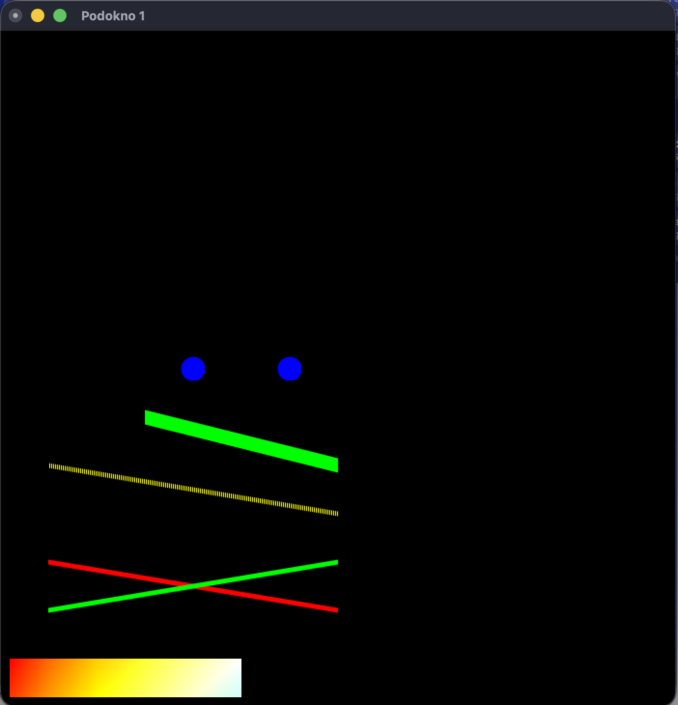
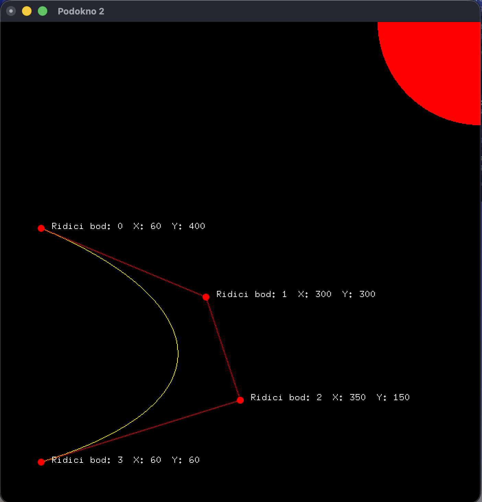
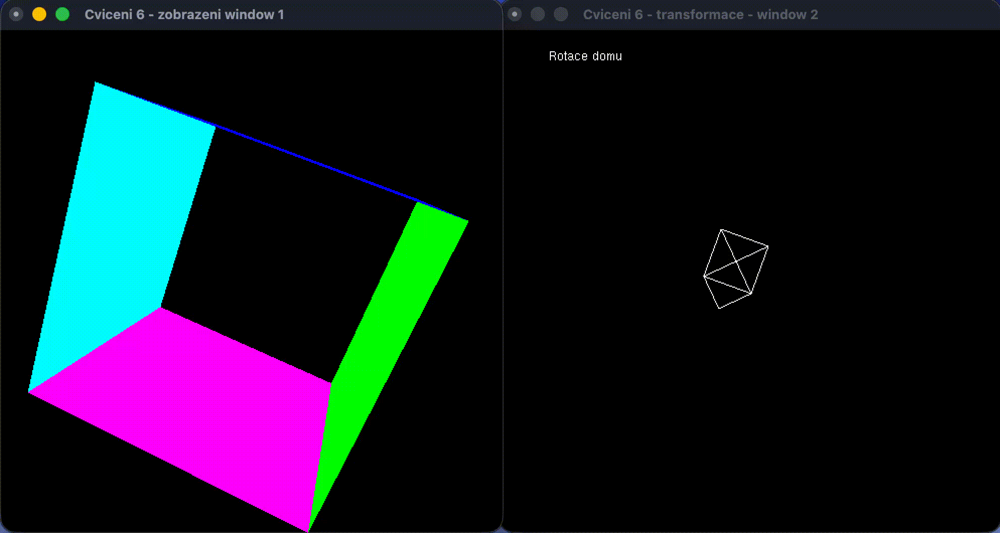
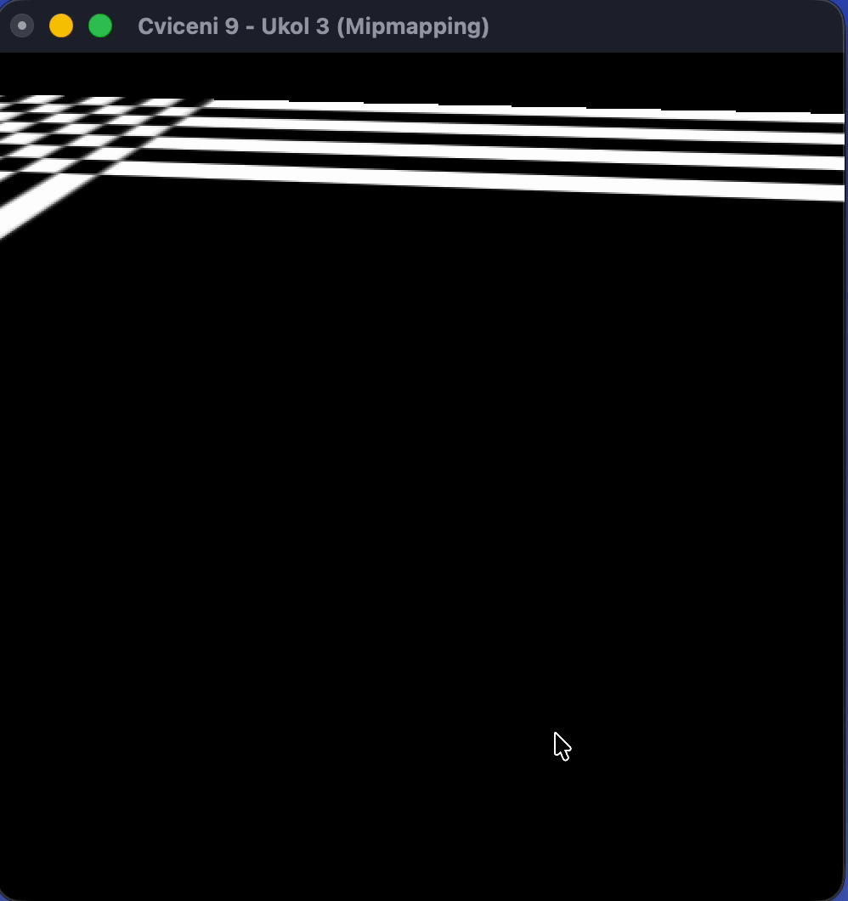
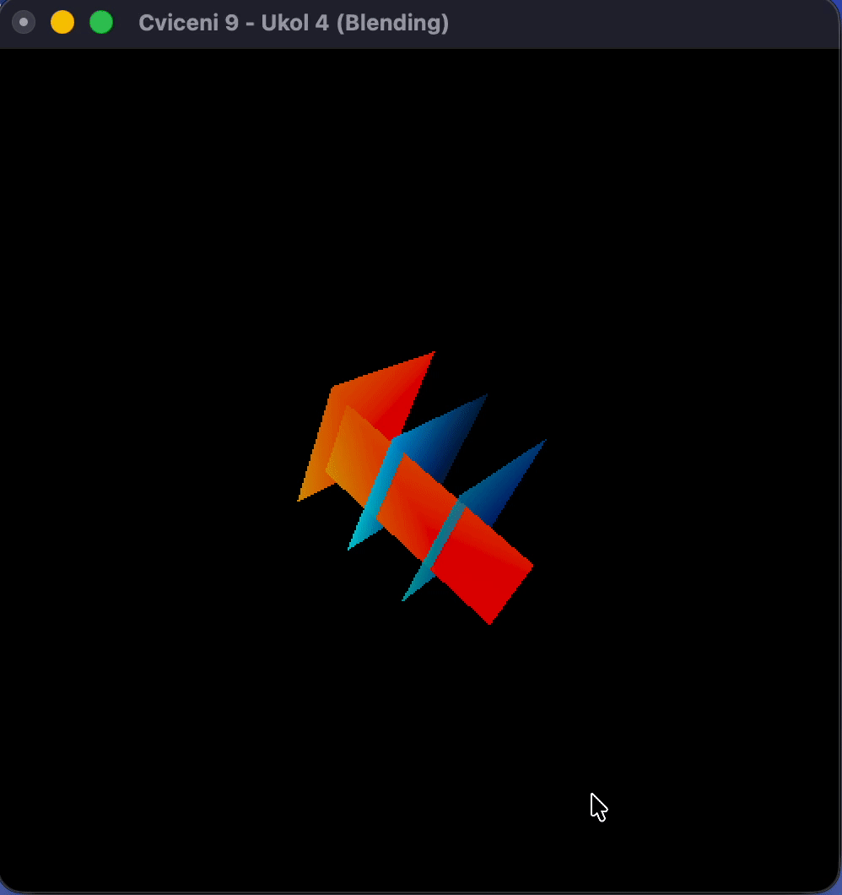
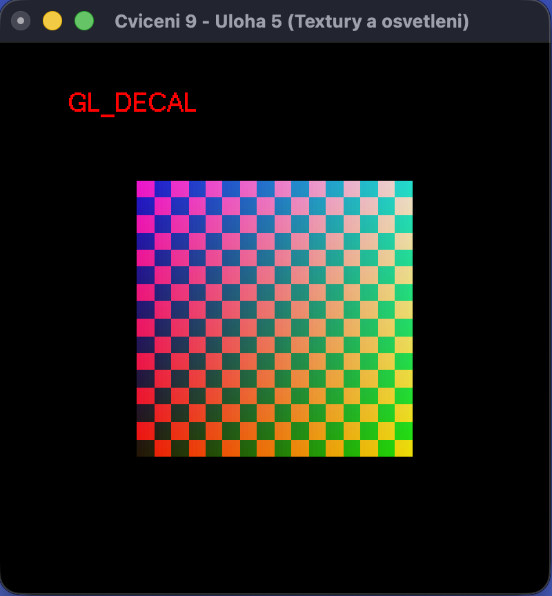
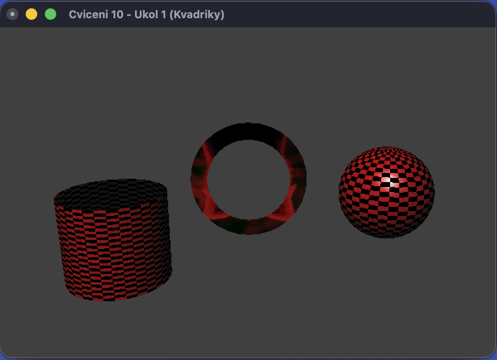

# fekt-mpg

Modern Computer Graphics (MPC-MPG) — exercise repository. Code lives on individual branches; this README tracks all exercises with screenshots.

---

## [CV1](tree/cv1) — C Basics & Pointers

Introductory C tasks: division, pointers, conditionals, multiply/sum functions.

---

## [CV2](tree/cv2) — OpenGL: Introduction to Rendering

Three windows: house outline, parametric parabola, transparency blending.

---

## [CV3](tree/cv3) — 2D Rendering & Bézier Curves

Primitives, vertex arrays, Bézier curves, text rendering in two OpenGL windows.

 

---

## [CV4](tree/cv4) — Menus, Keyboard, Mouse

Bezier/rect context menu, keyboard control for triangle strip, mouse drag for control points.

---

## [CV5](tree/cv5) — De Casteljau, Subdivision, Bézier Patch

De Casteljau algorithm, curve subdivision at t=0.5, bicubic Bézier surface via OpenGL evaluator.

  

---

## [CV6](tree/cv6) — 3D Scene Display & Geometric Transformations

Two-window app: 3D cube with perspective and camera, 2D house with transforms, timer-driven animation.

---

## [CV9](tree/cv9) — Texturing, mipmaps, blending, lighting

Texture loading, mipmaps, alpha blending, and text vs. lighting in OpenGL (`01_texturovani` … `04_text_vs_light`).

 

 

---

## [CV10](tree/cv10) — Advanced 3D Objects: GLU Quadrics & OBJ Loader

GLU quadric objects (sphere, disk, cylinder) with Phong lighting and textures. OBJ model exported from Blender, loaded and rendered with normals and UV textures.

 
