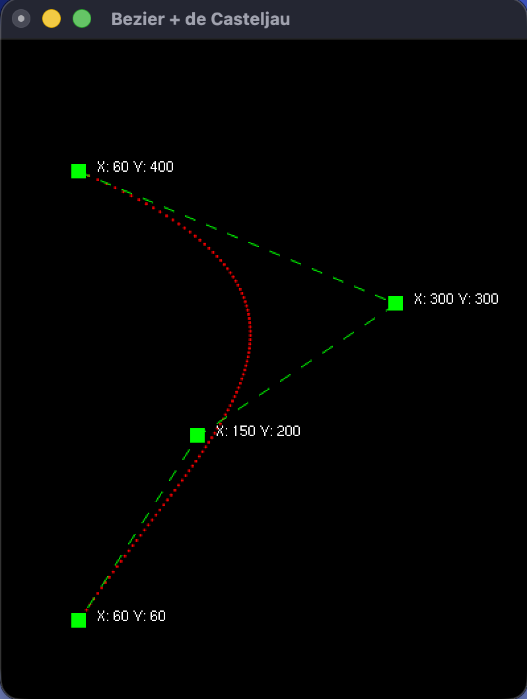

# CV5 — De Casteljau, Subdivision, Bézier Patch

Lab 5 of *Modern Computer Graphics* (MPC-MPG).  
Three tasks covering the de Casteljau algorithm, curve subdivision, and Bézier surface patches using the OpenGL evaluator.

---

## Task 1 — De Casteljau Algorithm (`01_deCasteljau.cpp`)

Implemented the `deCasteljau()` function that computes 100 points along a cubic Bézier curve.  
For each step `t ∈ [0, 1]` the algorithm runs `N-1` iterations — each pass linearly interpolates adjacent working control points until only one point remains, which is the curve point at that `t`.  
Control points can be dragged with the mouse; the curve updates in real time.

| Before | After |
|:---:|:---:|
|  |  |
| Only control polygon visible — curve not computed | Bezier cubic rendered in red via de Casteljau |

---

## Task 2 — Subdivision via De Casteljau (`02_subdivision.cpp`)

Implemented `subdivision()` which splits a cubic Bézier curve into two sub-curves at `t = 0.5` using a full de Casteljau pyramid.  
The intermediate points `P01`, `P12`, `P23`, `P0112`, `P1223`, and the midpoint `PC` define two new sets of 4 control points each.  
Both sub-curves and their control polygons are rendered alongside the original (yellow).

| Before | After |
|:---:|:---:|
|  |  |
| Only original curve and control polygon | Original (yellow) + left sub-curve (green) + right sub-curve (blue) |

---

## Task 3 — Bézier Patch Evaluator (`03_BezieruvPlat.cpp`)

Implemented `vykresliBezieruvPlat()` to render a bicubic Bézier surface patch using the OpenGL 2D evaluator.  
`glMap2f` is configured with the correct strides for the `float[u][v][xyz]` control point layout (`ustride = 12`, `vstride = 3`), then `glEvalCoord2f` samples the surface at density 50 in both `u` and `v` directions, rendering 51×51 points as `GL_POINTS`.  
The scene also shows the subdivision mesh (`zobrazMesh`) and the 16 control points for comparison.

| Before | After |
|:---:|:---:|
|  |  |
| Only subdivision mesh and control points visible | Evaluator surface (magenta points, density 50) added on top |
