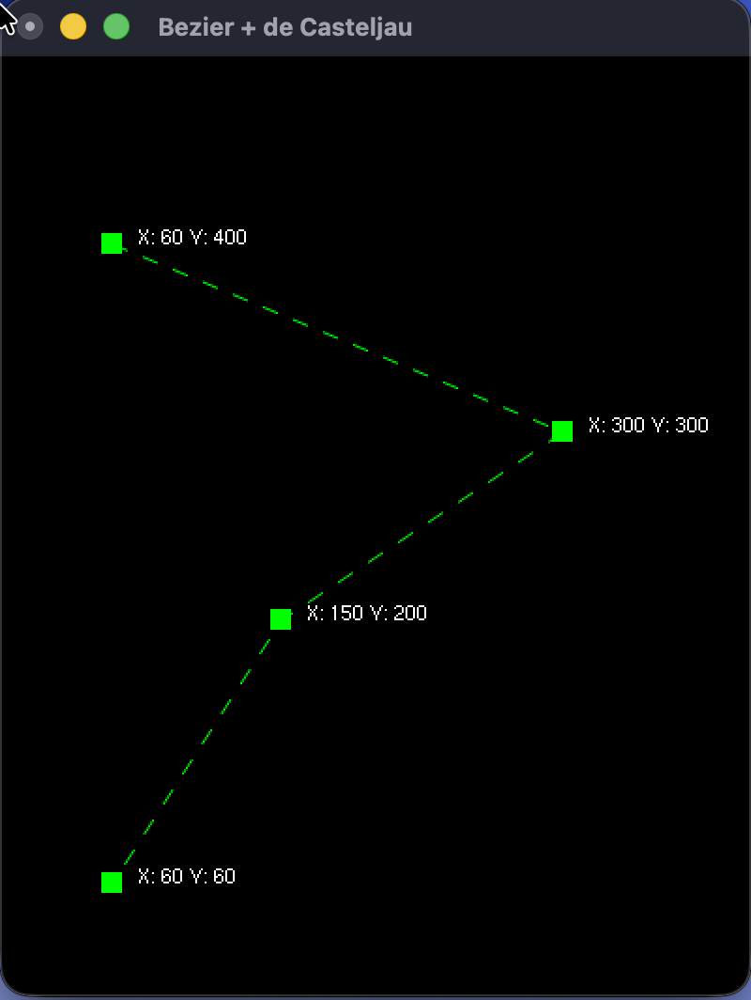
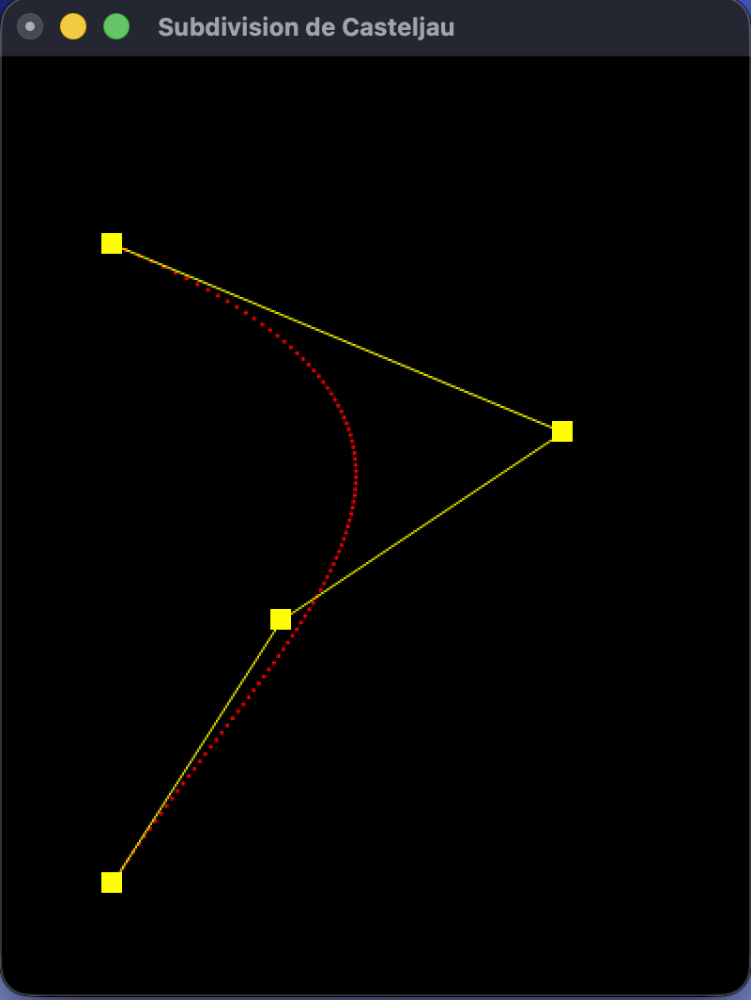
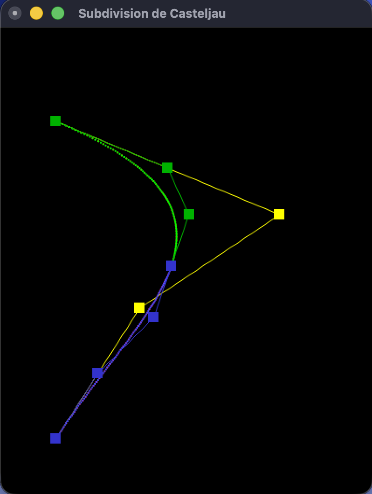
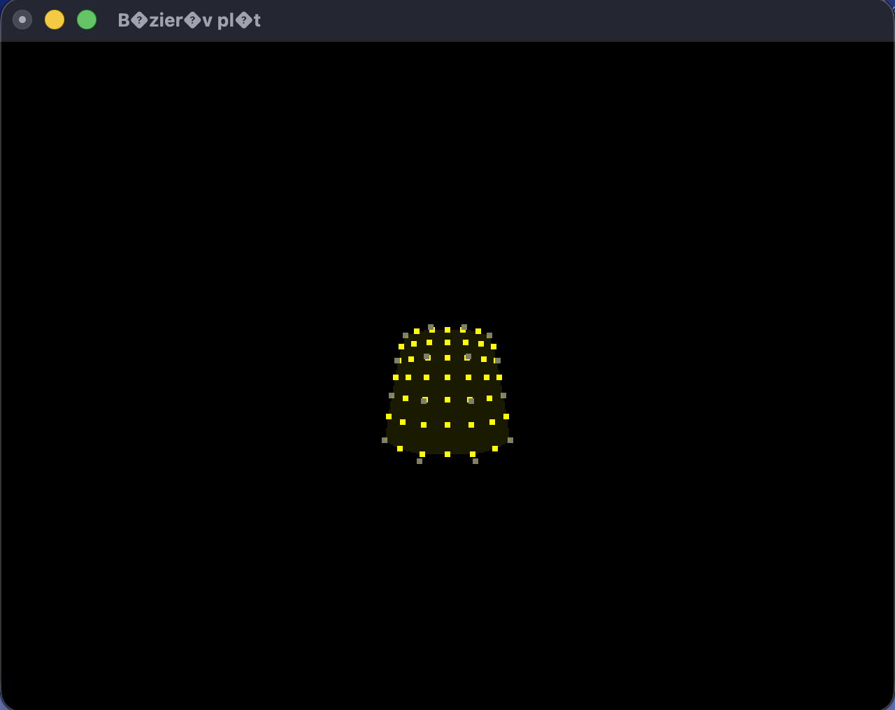
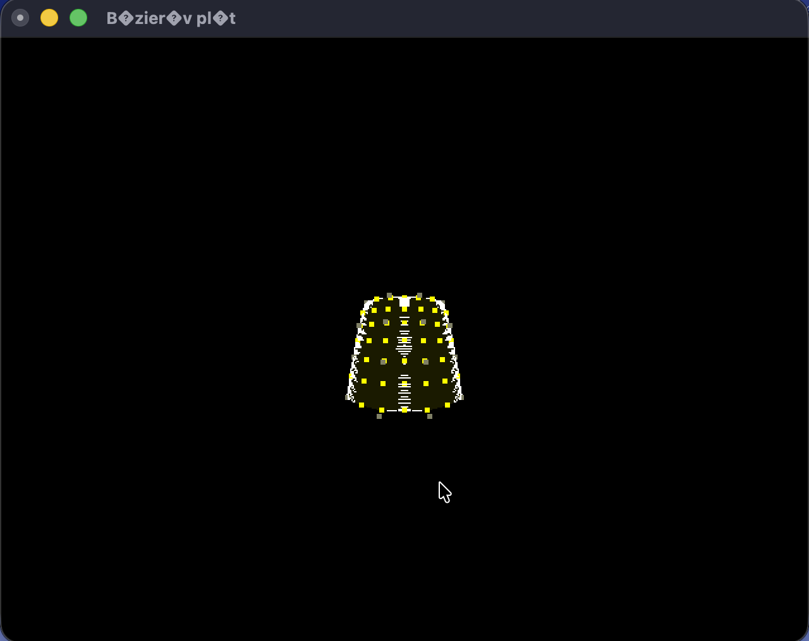

# CV6 — 3D Scene Display & Geometric Transformations

Lab 6 of *Modern Computer Graphics* (MPC-MPG).  
Two-window OpenGL app covering 3D projection, camera setup, affine transforms, and timer-driven animation.

---

## Task 1 — 3D Scene: Projection & Camera (`cv6_zadani.cpp`)

Implemented projection in `onReshape()` and camera setup in `onDisplay3D()`.  
`gluPerspective` for perspective projection; `gluLookAt(4, 4, 16)` for camera at origin.  
3D colored cube rendered via `vykresliObjekt()`.

| Before | After |
|:---:|:---:|
|  |  |
| placeholder | 3D cube with perspective and camera |

---

## Task 2 — 2D House with Transforms (`cv6_zadani.cpp`)

Implemented orthographic projection in `onReshape()` for window2 and transforms in `onDisplay2D()`.  
`glTranslatef(50, 50, 0)`, `glScalef(0.5, 0.5, 1.0)`, `glRotatef(-15, 0, 0, 1)` before `vykresliDomecek()`.  
House rotated 15° CW, scaled to half, translated to +50x, +50y.

| Before | After |
|:---:|:---:|
|  |  |
| placeholder | House with transforms applied |

---

## Task 3 — Animation (`cv6_zadani.cpp`)

Implemented timer-driven rotation in `onTimer()`: `angle += 5` every 15 ms, redraw both windows.  
Static "Rotace domu" text in window2 via `glPushMatrix`/`glPopMatrix`.  
Same `angle` applied to 3D cube in window1.

| Before | After |
|:---:|:---:|
|  |  |
| placeholder | Animated rotation in both windows |

---

## Overview

Two-window OpenGL app. Window 1 is a 3D scene (colored cube), Window 2 is a 2D scene (house outline).

## Build

```bash
mkdir -p build && cd build
cmake ..
make cv6_zadani
./cv6_zadani
```

> macOS deprecation warnings (GLUT, OpenGL) are suppressed via `GL_SILENCE_DEPRECATION` — safe to ignore.

## File

| File | Purpose |
|---|---|
| `cv6_zadani.cpp` | Full implementation |

## Controls

| Input | Action |
|---|---|
| Right-click menu → Timer → Spustit | Start rotation |
| Right-click menu → Timer → Zastavit | Stop rotation |
| Right-click menu → Reset pozice | Reset angle to -15° |
| Right-click menu → Konec → Ano | Exit |

## Key Concepts

### Matrix Modes
```cpp
glMatrixMode(GL_PROJECTION);  // affects projection math
glMatrixMode(GL_MODELVIEW);   // affects object/camera transforms
glLoadIdentity();             // always reset before new setup
```

### Projection
```cpp
// Orthographic — no perspective, z ignored
glOrtho(left, right, bottom, top, near, far);

// Perspective — FOV-based frustum
gluPerspective(fov_degrees, aspect_w_over_h, near, far);
```

### Camera
```cpp
// modelview matrix
gluLookAt(eyeX, eyeY, eyeZ,      // camera position
          centerX, centerY, centerZ,  // look-at target
          upX, upY, upZ);           // up vector
```

### Transforms (order matters — OpenGL applies them reversed)
```cpp
glTranslatef(x, y, z);
glScalef(x, y, z);
glRotatef(angle_deg, axisX, axisY, axisZ);
glMultMatrixd(matrix16);  // custom 4x4 column-major
```

### Static text during animated scene
```cpp
glPushMatrix();
  glLoadIdentity();           // undo all transforms
  bitmapText(x, y, font, s); // draw at fixed position
glPopMatrix();
```

### Timer loop pattern
```cpp
void onTimer(int value) {
    if (timerOn) {
        angle += 5;
        glutSetWindow(window2);
        glutPostRedisplay();
        glutTimerFunc(15, onTimer, value); // re-register for next tick
    }
}
```
